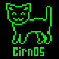

# CirnOS
CirnOS is an operating system for the Raspberry Pi built for the purpose of usability and simplicity. It provides a simple environment for running a Lua script that will run on the Raspberry Pi. It has no kernel or time management -- it is single threaded. You run your code on the device, and that is it.

CirnOS has only been tested on the Raspberry Pi Zero, but should work on the original Raspberry Pi and the Zero W.

Todo
-----
- Fix sbrk bug
- Load main.lua from root and hook bcm2835 library to Lua wrappers.
- Replace Lua interpreter with LuaJIT for speed.
- Add a graphics library for HDMI.
- Create plugins for IDEs to abstract away CirnOS (Like Arduino).
- Add WiFi and HTTP server library.
- Add USB connection library.

Current Bugs
-----
Right now there is an issue with Newlib. When calling certain functions like printf, something calls the _sbrk syscall requesting huge amounts of memory. These amounts are larger than the total memory for the rPi, so CirnOS runs out of memory instantly. With this bug fixed, development of CirnOS should be finished in a matter of days.

Building
-----
CirnOS currently can only be built on Mac and Linux devices. It requires an installation of Newlib for ARM, which can either be built by yourself with a bit of configuration or installed through a package such as libnewlib for Debian. Run the build.sh script to build kernel.img, configuring it as needed.

Using CirnOS
-----
- Format your rPi's SD card as FAT32, using a tool such as SD Association's SD Memory Card Formatter <https://www.sdcard.org/downloads/formatter_4/>.
- Make sure the root directory in the SD Card is empty, and that the SD Card has only one volume.
- Copy all files from ROOTDIR into the root of the SD Card.
- Copy kernel.img from OBJ into the root of the SD Card.
- Edit main.lua to control the rPi.
